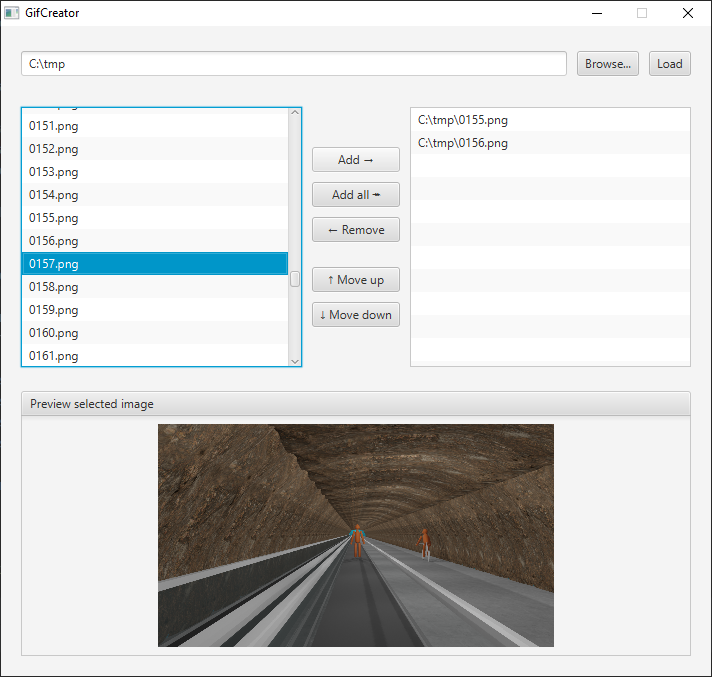
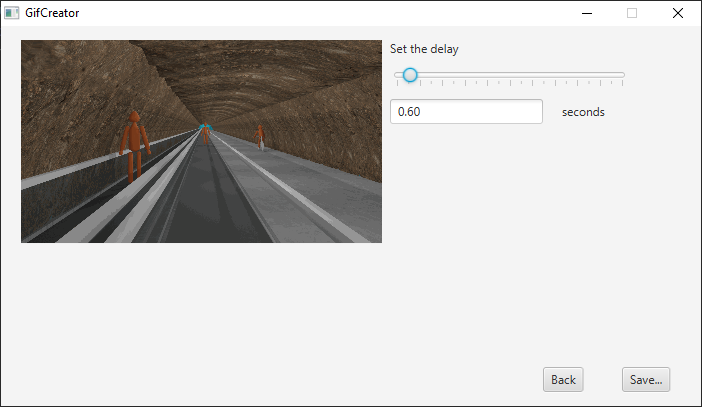

# GifCreator

An application with GUI for creating animated gifs from a list of source images.

## Screenshots

___

## Requirements
  * Java 1.8 (due to JavaFX)

## Known issues

Image quality is bad.
This does not apply dithering, palette optimization,
nor does it [emulate true color](https://en.wikipedia.org/wiki/GIF#True_color) by tiling sub-images.
